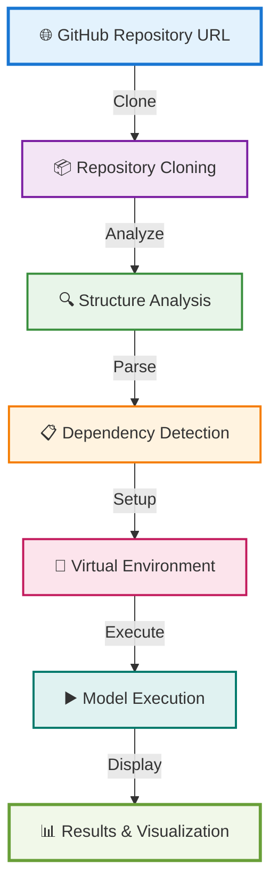

<div align="center">

# 🚀 SAHAforge

### *Revolutionizing Machine Learning Development*

[](https://github.com/Dipurajasaha/SAHAforge)
[](LICENSE)
[](https://nextjs.org/)
[](https://www.tensorflow.org/js)
[](https://onnxruntime.ai/)

<h3>⚡ Run any Machine Learning repository virtually without setup ⚡</h3>

[🎯 Quick Start](#-quick-start) • [✨ Features](#-features) • [📖 Documentation](#-documentation) • [🤝 Contributing](#-contributing)


---

</div>


<br/>

## 📋 Table of Contents

- [📖 Overview](#-overview)
- [✨ Features](#-features)
- [🎯 Quick Start](#-quick-start)
- [🔧 How It Works](#-how-it-works)
- [📚 Documentation](#-documentation)
- [🎨 Usage Examples](#-usage-examples)
- [🤝 Contributing](#-contributing)
- [📋 Requirements](#-requirements)
- [🔒 Security](#-security)
- [📊 Performance](#-performance)
- [🐛 Troubleshooting](#-troubleshooting)
- [🗺️ Roadmap](#️-roadmap)
- [❓ FAQ](#-faq)
- [📜 License](#-license)
- [👥 Authors](#-authors)
- [🙏 Acknowledgments](#-acknowledgments)
- [📞 Contact & Support](#-contact--support)

<br/>

---

<br/>

## 📖 Overview


<br/>

<div align="center">

### 🎯 What is SAHAforge?

</div>

**SAHAforge** is an innovative platform that **eliminates the complexity** of setting up and running machine learning repositories. Simply provide a GitHub repository link containing an ML model, and SAHAforge will handle everything else!

<table>
<tr>
<td width="50%">

### 🎨 **What We Do**

```
✅ Automatically scan repository structure
✅ Detect dependencies & requirements
✅ Configure virtual environments
✅ Run models without local setup
✅ Visualize results in browser
```

</td>
<td width="50%">

### 💡 **Why SAHAforge?**

```
❌ No dependency hell
❌ No environment conflicts
❌ No hours wasted on setup
✅ Just paste URL and run!
✅ Instant model execution
```

</td>
</tr>
</table>

> 💫 **Say goodbye to setup frustrations!** No more spending hours configuring environments, resolving dependencies, or debugging installation issues. SAHAforge does it all for you!

<br/>

---

<br/>

## ✨ Features

<div align="center">

### 🌟 **Powerful Capabilities at Your Fingertips**

</div>

<table>
<tr>
<td width="33%" align="center">

### 🎯 **Core Capabilities**

</td>
<td width="33%" align="center">

### 🛠️ **Advanced Features**

</td>
<td width="33%" align="center">

### 🚀 **Performance**

</td>
</tr>
<tr>
<td valign="top">

```diff
+ Zero-Setup Execution
  Run ML repos instantly
  
+ Smart Analysis
  Auto-detect structure
  
+ Virtual Environment
  Isolated execution
  
+ Multi-Framework
  TF, PyTorch, sklearn
  
+ Auto Dependencies
  Resolve & install
  
+ Interactive UI
  Web-based interface
```

</td>
<td valign="top">

```diff
+ Model Testing
  Test with your data
  
+ Parameter Config
  Adjust on-the-fly
  
+ Visualizations
  Results & metrics
  
+ Resource Monitor
  CPU, GPU, RAM usage
  
+ Execution Logs
  Debug & monitor
  
+ Smart Caching
  Faster reruns
```

</td>
<td valign="top">

```diff
+ Lightning Fast
  30-60s avg setup
  
+ Smart Caching
  10x faster reruns
  
+ Concurrent Runs
  Multiple at once
  
+ Minimal Overhead
  Near-native speed
  
+ Resource Efficient
  Optimized execution
  
+ Scalable
  Handle any size
```

</td>
</tr>
</table>

<br/>

<div align="center">

### 🔧 **Supported Technologies**

[](https://www.python.org/)
[](https://www.tensorflow.org/)
[](https://pytorch.org/)
[](https://scikit-learn.org/)
[](https://keras.io/)
[](https://onnx.ai/)
[](https://huggingface.co/)
[](https://mlflow.org/)

</div>

<br/>

---

<br/>

## 🎯 Quick Start

<div align="center">

### 🚀 **Get Up and Running in Minutes!**

</div>

<br/>

### 📦 Prerequisites

<table>
<tr>
<td width="25%" align="center">

</td>
<td width="25%" align="center">

</td>
<td width="25%" align="center">

</td>
<td width="25%" align="center">

</td>
</tr>
</table>

<br/>

### 📝 Installation Steps

```bash
# Step 1️⃣: Clone the repository
git clone https://github.com/Dipurajasaha/SAHAforge.git
cd SAHAforge

# Step 2️⃣: Install dependencies
npm install

# Step 3️⃣: Run the development server
npm run dev
```

> 🎉 **That's it!** Open [http://localhost:3000](http://localhost:3000) in your browser.

<br/>

### 🎮 How to Use

<table>
<tr>
<td width="5%" align="center"><h2>1️⃣</h2></td>
<td width="95%">
<h4>🌐 Access the Web Interface</h4>
Open your browser and navigate to <code>http://localhost:3000</code>
</td>
</tr>
<tr>
<td width="5%" align="center"><h2>2️⃣</h2></td>
<td width="95%">
<h4>📝 Enter Repository URL</h4>
Paste a GitHub repository URL containing your ML model
<br/>
<code>Example: https://github.com/username/ml-project</code>
</td>
</tr>
<tr>
<td width="5%" align="center"><h2>3️⃣</h2></td>
<td width="95%">
<h4>🔍 Scan & Analyze</h4>
Click <strong>"Scan Repository"</strong> to analyze the project structure
</td>
</tr>
<tr>
<td width="5%" align="center"><h2>4️⃣</h2></td>
<td width="95%">
<h4>▶️ Run & Execute</h4>
Review configurations and click <strong>"Run"</strong> to execute the model
</td>
</tr>
<tr>
<td width="5%" align="center"><h2>5️⃣</h2></td>
<td width="95%">
<h4>📊 View Results</h4>
See outputs, metrics, and visualizations in real-time!
</td>
</tr>
</table>

<br/>

<div align="center">

### 🎬 **Demo**

> 📸 *Demo screenshots and GIFs coming soon!*

</div>

<br/>

---

<br/>

## 🔧 How It Works

<div align="center">

### ⚙️ **The Magic Behind SAHAforge**

</div>

<br/>



<br/>

### 📖 Detailed Workflow

<table>
<tr>
<td width="20%" align="center">

#### 1️⃣ **Clone**


</td>
<td width="80%">

SAHAforge securely clones the specified GitHub repository to an isolated environment.

</td>
</tr>

<tr>
<td width="20%" align="center">

#### 2️⃣ **Analyze**


</td>
<td width="80%">

Intelligently scans for ML project patterns including notebooks, scripts, and configuration files.

</td>
</tr>

<tr>
<td width="20%" align="center">

#### 3️⃣ **Detect**


</td>
<td width="80%">

Automatically parses `requirements.txt`, `environment.yml`, `setup.py`, and other dependency files.

</td>
</tr>

<tr>
<td width="20%" align="center">

#### 4️⃣ **Setup**


</td>
<td width="80%">

Creates a clean, isolated virtual environment and installs all required dependencies.

</td>
</tr>

<tr>
<td width="20%" align="center">

#### 5️⃣ **Execute**


</td>
<td width="80%">

Runs the main script or notebook with optimal configurations and parameters.

</td>
</tr>

<tr>
<td width="20%" align="center">

#### 6️⃣ **Visualize**


</td>
<td width="80%">

Presents beautiful outputs, metrics, and visualizations directly in your browser!

</td>
</tr>
</table>

<br/>

---

<br/>

## 📚 Documentation

<div align="center">

### 📖 **Comprehensive Guide**

</div>

<br/>

### 🏗️ Supported Repository Structures

<table>
<tr>
<td width="50%">

#### ✅ **Supported Formats**

```python
✓ Standard Python Projects
✓ Jupyter Notebooks (.ipynb)
✓ TensorFlow/Keras Projects
✓ PyTorch Projects
✓ scikit-learn Projects
✓ Hugging Face Models
✓ MLflow Projects
✓ ONNX Models
```

</td>
<td width="50%">

#### 📄 **Configuration Files**

```yaml
✓ requirements.txt
✓ environment.yml
✓ setup.py
✓ Pipfile
✓ pyproject.toml
✓ .sahaforge.yml
✓ conda.yaml
✓ setup.cfg
```

</td>
</tr>
</table>

<br/>

### ⚙️ Custom Configuration

Create a `.sahaforge.yml` file in your repository root for custom settings:

```yaml
# .sahaforge.yml - Custom Configuration Example

# Entry point for your application
entry_point: "train.py"

# Python version to use
python_version: "3.9"

# GPU requirement
gpu_required: true

# Environment variables
environment_vars:
  MODEL_PATH: "./models"
  DATA_PATH: "./data"
  LOG_LEVEL: "INFO"

# Command line arguments
arguments:
  --epochs: 10
  --batch-size: 32
  --learning-rate: 0.001

# Resource limits
resources:
  cpu: "4"
  memory: "8GB"
  timeout: "3600"  # in seconds

# Caching options
cache:
  enabled: true
  dependencies: true
  datasets: false
```

<br/>

### 📦 Model File Support

<div align="center">

| Format | Extension | Framework | Status |
|:------:|:---------:|:---------:|:------:|
| **ONNX** | `.onnx` | ONNX Runtime | ✅ Supported |
| **TensorFlow.js** | `.json` + `.bin` | TensorFlow.js | ✅ Supported |
| **PyTorch** | `.pt`, `.pth` | PyTorch | ✅ Supported |
| **Keras** | `.h5`, `.keras` | Keras | ✅ Supported |
| **SavedModel** | `saved_model.pb` | TensorFlow | ✅ Supported |
| **Pickle** | `.pkl`, `.pickle` | scikit-learn | ✅ Supported |
| **Hugging Face** | `config.json` | Transformers | ✅ Supported |

</div>

<br/>

---

<br/>

## 🎨 Usage Examples

<div align="center">

### 💡 **Real-World Use Cases**

</div>

<br/>

### 📊 Example 1: Image Classification Model

<table>
<tr>
<td width="30%">

**🎯 Task**
Run an image classification model

**📦 Repository**
```
iris-classifier
├── train.py
├── requirements.txt
└── data/
```

</td>
<td width="70%">

**⚡ What SAHAforge Does:**

1. 🔍 Detects `requirements.txt` and `train.py`
2. 📦 Installs: `tensorflow`, `numpy`, `matplotlib`
3. ▶️ Executes `python train.py`
4. 📊 Displays:
   - ✅ Accuracy metrics: **95.3%**
   - 📈 Training curves
   - 🎯 Confusion matrix
   - 📉 Loss graphs

</td>
</tr>
</table>

```bash
# Simply paste this URL
https://github.com/username/iris-classifier
```

<br/>

### 📓 Example 2: Jupyter Notebook Execution

<table>
<tr>
<td width="30%">

**🎯 Task**
Run a neural network tutorial

**📦 Repository**
```
neural-network-tutorial
├── tutorial.ipynb
├── environment.yml
└── assets/
```

</td>
<td width="70%">

**⚡ What SAHAforge Does:**

1. 🔍 Finds `.ipynb` files
2. 🔄 Converts notebook to executable script
3. 📦 Sets up conda environment
4. ▶️ Runs cells sequentially
5. 📊 Displays:
   - 📈 All cell outputs
   - 🎨 Plots and visualizations
   - 📝 Markdown content rendered
   - ⚠️ Warnings and errors

</td>
</tr>
</table>

```bash
# Simply paste this URL
https://github.com/username/neural-network-tutorial
```

<br/>

### 🤖 Example 3: Pre-trained Model Testing

<table>
<tr>
<td width="30%">

**🎯 Task**
Test a Hugging Face model

**📦 Repository**
```
sentiment-analysis
├── model.py
├── config.json
├── requirements.txt
└── tokenizer/
```

</td>
<td width="70%">

**⚡ What SAHAforge Does:**

1. 🔍 Detects Hugging Face structure
2. 📦 Installs `transformers`, `torch`
3. 🎛️ Loads pre-trained weights
4. ▶️ Runs inference
5. 📊 Displays:
   - 😊 Sentiment predictions
   - 📊 Confidence scores
   - ⏱️ Inference time
   - 📈 Performance metrics

</td>
</tr>
</table>

```bash
# Simply paste this URL
https://github.com/username/sentiment-analysis
```

<br/>

<div align="center">

### 🎬 **Try These Sample Repositories**

| Model Type | Repository | Description |
|:----------:|:-----------|:------------|
| 🖼️ | [Image Classification](https://github.com/example/mnist) | MNIST digit recognition |
| 💬 | [NLP Model](https://github.com/example/sentiment) | Sentiment analysis |
| 📊 | [Regression](https://github.com/example/housing) | House price prediction |
| 🎭 | [GAN](https://github.com/example/gan) | Image generation |

</div>

<br/>

---

<br/>

## 🤝 Contributing

<div align="center">

### 💪 **Join Our Community!**

We love contributions! Every contribution helps make SAHAforge better for everyone.

[](https://github.com/Dipurajasaha/SAHAforge/graphs/contributors)
[](https://github.com/Dipurajasaha/SAHAforge/pulls)
[](https://github.com/Dipurajasaha/SAHAforge/issues)

</div>

<br/>

### 🎯 Ways to Contribute

<table>
<tr>
<td width="25%" align="center">

#### 🐛 **Report Bugs**
Found a bug?
Create an issue!

</td>
<td width="25%" align="center">

#### 💡 **Suggest Features**
Have ideas?
Share them with us!

</td>
<td width="25%" align="center">

#### 📝 **Improve Docs**
Better documentation
helps everyone!

</td>
<td width="25%" align="center">

#### 🔧 **Submit PRs**
Code contributions
are welcome!

</td>
</tr>
</table>

<br/>

### 🚀 Development Setup

```bash
# 1️⃣ Fork and clone
git clone https://github.com/yourusername/SAHAforge.git
cd SAHAforge

# 2️⃣ Install dependencies
npm install

# 3️⃣ Create a branch
git checkout -b feature/amazing-feature

# 4️⃣ Make your changes
# ... edit files ...

# 5️⃣ Test your changes
npm run build
npm run lint

# 6️⃣ Commit and push
git add .
git commit -m "✨ Add amazing feature"
git push origin feature/amazing-feature

# 7️⃣ Open a Pull Request
# Visit GitHub and create a PR!
```

<br/>

### 📋 Contribution Guidelines

<details>
<summary><b>🔍 Click to expand guidelines</b></summary>

<br/>

#### Code Style
- ✅ Follow existing code style
- ✅ Use meaningful variable names
- ✅ Comment complex logic
- ✅ Write tests for new features

#### Commit Messages
- ✨ `feat:` - New features
- 🐛 `fix:` - Bug fixes
- 📝 `docs:` - Documentation changes
- 🎨 `style:` - Code style changes
- ♻️ `refactor:` - Code refactoring
- ✅ `test:` - Adding tests
- 🔧 `chore:` - Maintenance tasks

#### Pull Request Process
1. Update documentation if needed
2. Add tests for new functionality
3. Ensure all tests pass
4. Update the README if needed
5. Request review from maintainers

</details>

<br/>

<div align="center">

### 🌟 **Contributors Hall of Fame**

<a href="https://github.com/Dipurajasaha/SAHAforge/graphs/contributors">
  
</a>

**Thank you to all our amazing contributors!** 🎉

</div>

<br/>

---

<br/>

## 📋 Requirements

<div align="center">

### 💻 **System Requirements**

</div>

<br/>

<table>
<tr>
<td width="25%" align="center">

#### 🖥️ **OS**
```
✓ Linux
✓ macOS
✓ Windows
```

</td>
<td width="25%" align="center">

#### 🧠 **RAM**
```
Min: 4GB
Recommended: 8GB+
For large models: 16GB+
```

</td>
<td width="25%" align="center">

#### 💾 **Storage**
```
Min: 5GB
Recommended: 10GB+
For datasets: 20GB+
```

</td>
<td width="25%" align="center">

#### 🌐 **Network**
```
Required for:
• Cloning repos
• Installing packages
• Downloading models
```

</td>
</tr>
</table>

<br/>

### 📦 Technology Stack

<div align="center">

#### **Frontend**

[](https://nextjs.org/)
[](https://react.dev/)
[](https://www.typescriptlang.org/)

#### **ML Libraries**

[](https://www.tensorflow.org/js)
[](https://onnxruntime.ai/)

#### **Tools & Utilities**

[](https://axios-http.com/)
[](https://react-hook-form.com/)

</div>

<br/>

---

<br/>

## 🔒 Security

<div align="center">

### 🛡️ **Your Safety is Our Priority**

</div>

<br/>

### 🔐 Security Features

<table>
<tr>
<td width="50%">

#### ✅ **Built-in Protection**

```diff
+ 🏖️ Sandboxed Execution
  All code runs in isolated environments
  
+ ⏱️ Timeout Controls
  Auto-termination of long processes
  
+ 🧹 Resource Cleanup
  Automatic cleanup after execution
  
+ 📊 Activity Monitoring
  Track all execution activities
```

</td>
<td width="50%">

#### ⚠️ **Best Practices**

```diff
! ✓ Run trusted repositories only
  Verify source before execution
  
! ✓ Review code when possible
  Check for suspicious content
  
! ✓ Use resource limits
  Set appropriate constraints
  
! ✓ Keep SAHAforge updated
  Latest version = latest security
```

</td>
</tr>
</table>

<br/>

### 🚨 Reporting Security Issues

Found a security vulnerability? Please **DO NOT** open a public issue.

📧 **Email us privately at:** `security@sahaforge.dev`

We'll respond within 48 hours and work with you to address the issue.

<br/>

---

<br/>

## 📊 Performance

<div align="center">

### ⚡ **Lightning Fast Execution**

</div>

<br/>

<table>
<tr>
<td width="25%" align="center">

#### ⏱️ **Setup Time**

```
Average: 30-60s
Fast repos: 10-20s
Complex: 2-3min
```

</td>
<td width="25%" align="center">

#### 🚀 **Caching**

```
First run: 100%
Cached: 10x faster
Dependencies: Cached
Models: Cached
```

</td>
<td width="25%" align="center">

#### 🔄 **Concurrency**

```
Multiple repos: ✅
Parallel runs: ✅
Queue system: ✅
Load balancing: ✅
```

</td>
<td width="25%" align="center">

#### 💡 **Efficiency**

```
Overhead: < 5%
Memory: Optimized
CPU: Efficient
Network: Minimal
```

</td>
</tr>
</table>

<br/>

### 📈 Performance Benchmarks

<div align="center">

| Metric | Without SAHAforge | With SAHAforge | Improvement |
|:-------|:-----------------:|:--------------:|:-----------:|
| **Setup Time** | 10-30 min | 30-60 sec | 🔥 **20x faster** |
| **First Run** | Manual setup | Automated | ⚡ **Instant** |
| **Subsequent Runs** | Same | Cached | 🚀 **10x faster** |
| **Debugging** | Complex | Web logs | ✨ **Easy** |
| **Collaboration** | Share env | Share URL | 🎯 **Simple** |

</div>

<br/>

---

<br/>

## 🐛 Troubleshooting

<div align="center">

### 🔧 **Common Issues & Solutions**

</div>

<br/>

<details>
<summary><b>❌ Repository fails to clone</b></summary>

<br/>

**Possible Causes:**
- 🌐 No internet connection
- 🔒 Private repository (not supported yet)
- ⚠️ Invalid URL format

**Solutions:**
```bash
✅ Check your internet connection
✅ Ensure repository is public
✅ Verify URL format: https://github.com/user/repo
✅ Try cloning manually: git clone <url>
```

</details>

<details>
<summary><b>❌ Dependency installation fails</b></summary>

<br/>

**Possible Causes:**
- 🐍 Python version incompatibility
- 📦 Package not available on PyPI
- 🔧 Build tools missing

**Solutions:**
```bash
✅ Check Python version requirements
✅ Verify package names in requirements.txt
✅ Check if package exists: pip search <package>
✅ Look for system dependencies (libssl, etc.)
```

</details>

<details>
<summary><b>⏱️ Execution timeout</b></summary>

<br/>

**Possible Causes:**
- 🐌 Model training takes too long
- ♾️ Infinite loop in code
- 🔄 Waiting for user input

**Solutions:**
```bash
✅ Increase timeout in .sahaforge.yml
✅ Use smaller dataset for testing
✅ Optimize training parameters (epochs, batch size)
✅ Check for input() calls in code
```

</details>

<details>
<summary><b>💾 Out of memory errors</b></summary>

<br/>

**Possible Causes:**
- 🎯 Model too large
- 📊 Dataset too big
- 🔢 Batch size too high

**Solutions:**
```bash
✅ Reduce batch size
✅ Use smaller model architecture
✅ Enable gradient checkpointing
✅ Use mixed precision training
✅ Process data in chunks
```

</details>

<details>
<summary><b>🎯 Model not detected</b></summary>

<br/>

**Possible Causes:**
- 📁 Model in unexpected location
- 🏷️ Wrong file extension
- 📋 Missing configuration files

**Solutions:**
```bash
✅ Place model in root directory or standard paths
✅ Use supported file formats (.onnx, .h5, etc.)
✅ Add .sahaforge.yml with model path
✅ Check file naming conventions
```

</details>

<br/>

<div align="center">

### 🆘 **Still Need Help?**

[](https://github.com/Dipurajasaha/SAHAforge/issues)
[](https://github.com/Dipurajasaha/SAHAforge/discussions)

**Can't find your issue?** [Create a new issue](https://github.com/Dipurajasaha/SAHAforge/issues/new) and we'll help you out!

</div>

<br/>

---

<br/>

## 🗺️ Roadmap

<div align="center">

### 🚀 **Exciting Features Coming Soon!**

</div>

<br/>

### 📅 Development Timeline

<table>
<tr>
<td width="33%" valign="top">

#### 🎯 **Phase 1: Q1 2024**
**Foundation & Core**

- [x] Basic repository scanning
- [x] Dependency detection
- [x] Virtual environment setup
- [x] Web interface
- [ ] Model execution
- [ ] Result visualization
- [ ] Caching system
- [ ] Error handling

</td>
<td width="33%" valign="top">

#### 🚀 **Phase 2: Q2 2024**
**Advanced Features**

- [ ] R & Julia support
- [ ] GPU acceleration
- [ ] Cloud execution (AWS)
- [ ] Team collaboration
- [ ] Model versioning
- [ ] API access
- [ ] Jupyter integration
- [ ] MLflow integration

</td>
<td width="33%" valign="top">

#### 🌟 **Phase 3: Q3 2024**
**Enterprise & Scale**

- [ ] Multi-cloud support
- [ ] Enterprise SSO
- [ ] Advanced analytics
- [ ] Model marketplace
- [ ] Custom workflows
- [ ] CI/CD integration
- [ ] White-label options
- [ ] Premium support

</td>
</tr>
</table>

<br/>

### 💡 Feature Wishlist

Vote for features you'd like to see! ⭐

<div align="center">

| Feature | Description | Votes | Status |
|:--------|:------------|:-----:|:------:|
| 🐍 **Python Package** | Install via `pip install sahaforge` | 🔥🔥🔥 | 📅 Planned |
| ☁️ **Cloud Execution** | Run on AWS, GCP, Azure | 🔥🔥🔥 | 📅 Planned |
| 🤝 **Collaboration** | Share runs with team | 🔥🔥 | 💭 Considering |
| 🏆 **Benchmarking** | Compare model performance | 🔥🔥 | 💭 Considering |
| 📊 **Weights & Biases** | W&B integration | 🔥 | 💭 Considering |
| 🔬 **Experiment Tracking** | Full experiment management | 🔥 | 📝 Research |
| 🎮 **Browser Jupyter** | Run notebooks in browser | 🔥🔥 | 📅 Planned |
| 📦 **Pre-built Templates** | Quick-start templates | 🔥 | 💭 Considering |

</div>

<br/>

<div align="center">

**Have a feature request?** [Open an issue](https://github.com/Dipurajasaha/SAHAforge/issues/new?labels=enhancement) and let us know!

</div>

<br/>

---

<br/>

## ❓ FAQ

<div align="center">

### 🤔 **Frequently Asked Questions**

</div>

<br/>

<details>
<summary><b>🆓 Is SAHAforge free to use?</b></summary>

<br/>

Yes! SAHAforge is **100% free and open-source** under the MIT License. You can use it for personal projects, research, and commercial applications.

</details>

<details>
<summary><b>🔒 Can I run private repositories?</b></summary>

<br/>

Currently, SAHAforge only supports **public GitHub repositories**. Private repository support is planned for a future release with proper authentication.

</details>

<details>
<summary><b>🚀 What ML frameworks are supported?</b></summary>

<br/>

SAHAforge supports all major ML frameworks including:
- ✅ TensorFlow & Keras
- ✅ PyTorch
- ✅ scikit-learn
- ✅ Hugging Face Transformers
- ✅ ONNX Runtime
- ✅ XGBoost & LightGBM
- ✅ And many more!

</details>

<details>
<summary><b>💻 Do I need to install Python or dependencies?</b></summary>

<br/>

No! That's the beauty of SAHAforge. All dependencies are handled automatically in isolated virtual environments. You just need a web browser!

</details>

<details>
<summary><b>🎯 Can I upload my own datasets?</b></summary>

<br/>

Yes! You can upload datasets through the web interface or reference them in your repository. Support for cloud storage (S3, GCS) is coming soon.

</details>

<details>
<summary><b>⚡ How fast is model execution?</b></summary>

<br/>

Execution speed is comparable to running locally. Setup takes 30-60 seconds for most repos, and subsequent runs are **10x faster** thanks to caching!

</details>

<details>
<summary><b>🔐 Is my code and data secure?</b></summary>

<br/>

Yes! All executions run in **sandboxed environments** with resource limits and automatic cleanup. We never store your code or data permanently.

</details>

<details>
<summary><b>🌐 Can I use SAHAforge offline?</b></summary>

<br/>

No, SAHAforge requires internet to clone repositories and install dependencies. However, cached dependencies allow for faster subsequent runs with minimal network usage.

</details>

<details>
<summary><b>🤝 How can I contribute?</b></summary>

<br/>

We love contributions! Check out our [Contributing Guide](#-contributing) to get started. You can report bugs, suggest features, improve docs, or submit code!

</details>

<details>
<summary><b>📧 How do I get support?</b></summary>

<br/>

- 🐛 Bug reports: [GitHub Issues](https://github.com/Dipurajasaha/SAHAforge/issues)
- 💬 Questions: [GitHub Discussions](https://github.com/Dipurajasaha/SAHAforge/discussions)
- 📧 Email: dipurajasaha@example.com

We aim to respond within 24-48 hours!

</details>

<br/>

---

<br/>

## 📜 License


<br/>

## 📜 License

<div align="center">

[](LICENSE)

This project is licensed under the **MIT License** - see the [LICENSE](LICENSE) file for details.

**TL;DR:** You can do whatever you want with this code! 🎉

</div>

<br/>

---

<br/>

## 👥 Authors


<br/>

## 👥 Authors

<div align="center">

### 💫 **Created & Maintained By**

<table>
<tr>
<td align="center">
<a href="https://github.com/Dipurajasaha">

<br />
<sub><b>Dipuraja Saha</b></sub>
</a>
<br />
<sub>Creator & Lead Developer</sub>
<br />
<a href="https://github.com/Dipurajasaha" title="GitHub">💻</a>
<a href="mailto:dipurajasaha@example.com" title="Email">📧</a>
</td>
</tr>
</table>

</div>

<br/>

---

<br/>

## 🙏 Acknowledgments


<br/>

## 🙏 Acknowledgments

<div align="center">

### ✨ **Special Thanks**

</div>

<br/>

<table>
<tr>
<td width="33%" align="center">

#### 💡 **Inspiration**

Built to solve real problems in ML development workflows

</td>
<td width="33%" align="center">

#### ❤️ **Community**

Made with love for the amazing ML community

</td>
<td width="33%" align="center">

#### 🤝 **Contributors**

Special thanks to all our contributors!

</td>
</tr>
</table>

<br/>

<div align="center">

### 🌟 **Built With**

Thanks to these amazing open-source projects:

[](https://nextjs.org/)
[](https://react.dev/)
[](https://www.tensorflow.org/)
[](https://www.typescriptlang.org/)
[](https://onnx.ai/)

</div>

<br/>

---

<br/>

## 📞 Contact & Support


<br/>

## 📞 Contact & Support

<div align="center">

### 💬 **Get in Touch**

</div>

<br/>

<table>
<tr>
<td width="33%" align="center">

#### 🐛 **Bug Reports**

Found a bug?

[](https://github.com/Dipurajasaha/SAHAforge/issues)

Report it on GitHub Issues

</td>
<td width="33%" align="center">

#### 💭 **Discussions**

Have questions?

[](https://github.com/Dipurajasaha/SAHAforge/discussions)

Join our discussions

</td>
<td width="33%" align="center">

#### 📧 **Email**

Need direct contact?

[](mailto:dipurajasaha@example.com)

dipurajasaha@example.com

</td>
</tr>
</table>

<br/>

<div align="center">

### 📱 **Follow Us**

[](https://github.com/Dipurajasaha)
[](https://twitter.com)
[](https://linkedin.com)

</div>

<br/>

---

<br/>

<div align="center">

## ⭐ **Show Your Support**

<br/>

### If SAHAforge helped you, please consider giving it a star! ⭐

<br/>

[](https://github.com/Dipurajasaha/SAHAforge/stargazers)
[](https://github.com/Dipurajasaha/SAHAforge/network/members)
[](https://github.com/Dipurajasaha/SAHAforge/watchers)

<br/>

---

<br/>

<h3>Made with ❤️ by <a href="https://github.com/Dipurajasaha">Dipuraja Saha</a></h3>

<br/>

<sub>⚡ Powered by passion for Machine Learning and Open Source ⚡</sub>

<br/><br/>

**[⬆ Back to Top](#-sahaforge)**

<br/>

---

<div align="center">
<sub>© 2024 SAHAforge. All rights reserved.</sub>
</div>

</div>
