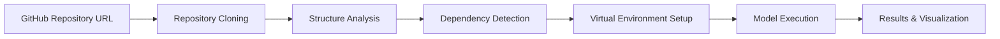

# SAHAforge 🚀
🚧 *Status: Under Development* 🚧


**Run any Machine Learning repository virtually without setup**

## 📖 Overview

SAHAforge is an innovative platform that eliminates the complexity of setting up and running machine learning repositories. Simply provide a GitHub repository link containing an ML model, and SAHAforge will:

- 🔍 **Automatically scan** the repository structure
- 📦 **Detect dependencies** and requirements
- ⚙️ **Configure the environment** virtually
- ▶️ **Run the model** without any local setup

No more dependency hell, no more environment conflicts, no more hours wasted on configuration!

---

## ✨ Features

### 🎯 Core Capabilities

- **Zero-Setup Execution**: Run ML repositories instantly without installing dependencies locally
- **Smart Repository Analysis**: Automatically detects project structure, dependencies, and entry points
- **Virtual Environment**: Isolated execution environment for each repository
- **Multi-Framework Support**: Compatible with TensorFlow, PyTorch, scikit-learn, and more
- **Dependency Resolution**: Automatically resolves and installs required packages
- **Interactive Interface**: User-friendly web interface for managing executions

### 🛠️ Advanced Features

- **Model Testing**: Test models with your own data
- **Parameter Configuration**: Adjust hyperparameters and settings on-the-fly
- **Output Visualization**: View results, metrics, and visualizations
- **Resource Monitoring**: Track CPU, GPU, and memory usage
- **Execution Logs**: Detailed logs for debugging and monitoring
- **Repository Caching**: Faster subsequent runs with smart caching

---

## 🚀 Quick Start

### Prerequisites

- Python 3.8 or higher
- Docker (optional, for containerized execution)
- Git

### Installation

```bash
# Clone the repository
git clone https://github.com/Dipurajasaha/SAHAforge.git
cd SAHAforge

# Install dependencies
pip install -r requirements.txt

# Run the application
python app.py
```

### Using SAHAforge

1. **Launch the Application**
   ```bash
   python app.py
   ```

2. **Access the Web Interface**
   - Open your browser and navigate to `http://localhost:5000`

3. **Enter Repository URL**
   - Paste the GitHub repository URL containing your ML model
   - Example: `https://github.com/username/ml-project`

4. **Scan & Run**
   - Click "Scan Repository" to analyze the project
   - Review detected configurations
   - Click "Run" to execute the model virtually

---

## 🔧 How It Works



### Workflow

1. **Repository Cloning**: SAHAforge clones the specified GitHub repository
2. **Structure Analysis**: Scans for common ML project patterns (notebooks, scripts, configs)
3. **Dependency Detection**: Parses `requirements.txt`, `environment.yml`, `setup.py`, etc.
4. **Environment Setup**: Creates an isolated virtual environment with all dependencies
5. **Execution**: Runs the main script or notebook with proper configurations
6. **Results Display**: Presents outputs, metrics, and visualizations in the web interface

---

## 📚 Documentation

### Supported Repository Structures

SAHAforge automatically detects and supports various ML project structures:

```
✅ Standard Python Projects
✅ Jupyter Notebooks
✅ TensorFlow/Keras Projects
✅ PyTorch Projects
✅ scikit-learn Projects
✅ Hugging Face Models
✅ MLflow Projects
```

### Configuration Files

SAHAforge recognizes and processes:

- `requirements.txt` - Python dependencies
- `environment.yml` - Conda environments
- `setup.py` - Package setup files
- `Pipfile` - Pipenv dependencies
- `pyproject.toml` - Poetry projects
- `.sahaforge.yml` - Custom SAHAforge configurations

### Custom Configuration

Create a `.sahaforge.yml` file in your repository root for custom settings:

```yaml
# .sahaforge.yml
entry_point: "train.py"
python_version: "3.9"
gpu_required: true
environment_vars:
  MODEL_PATH: "./models"
  DATA_PATH: "./data"
arguments:
  --epochs: 10
  --batch-size: 32
```

---

## 🎨 Usage Examples

### Example 1: Running a Simple Classification Model

```bash
# Enter this URL in SAHAforge
https://github.com/username/iris-classifier
```

SAHAforge will:
1. Clone the repository
2. Detect `requirements.txt` and `train.py`
3. Install dependencies
4. Execute the training script
5. Display accuracy metrics and confusion matrix

### Example 2: Running a Jupyter Notebook

```bash
# Enter this URL in SAHAforge
https://github.com/username/neural-network-tutorial
```

SAHAforge will:
1. Scan for `.ipynb` files
2. Convert notebook to executable script
3. Run cells sequentially
4. Display outputs and visualizations

---

## 🤝 Contributing

We welcome contributions! Here's how you can help:

### Ways to Contribute

- 🐛 Report bugs and issues
- 💡 Suggest new features
- 📝 Improve documentation
- 🔧 Submit pull requests

### Development Setup

```bash
# Fork and clone the repository
git clone https://github.com/yourusername/SAHAforge.git
cd SAHAforge

# Create a virtual environment
python -m venv venv
source venv/bin/activate  # On Windows: venv\Scripts\activate

# Install development dependencies
pip install -r requirements-dev.txt

# Run tests
pytest tests/

# Run with debug mode
python app.py --debug
```

### Contribution Guidelines

1. Fork the repository
2. Create a feature branch (`git checkout -b feature/AmazingFeature`)
3. Commit your changes (`git commit -m 'Add some AmazingFeature'`)
4. Push to the branch (`git push origin feature/AmazingFeature`)
5. Open a Pull Request

---

## 📋 Requirements

### System Requirements

- **OS**: Linux, macOS, or Windows
- **RAM**: Minimum 4GB (8GB+ recommended for large models)
- **Storage**: 10GB free space
- **Internet**: Required for repository cloning and package installation

### Python Dependencies

```
flask>=2.0.0
gitpython>=3.1.0
docker>=5.0.0
pyyaml>=5.4.0
requests>=2.26.0
numpy>=1.21.0
pandas>=1.3.0
```

---

## 🔒 Security

SAHAforge takes security seriously:

- **Sandboxed Execution**: All code runs in isolated environments
- **Resource Limits**: CPU and memory limits prevent resource exhaustion
- **Timeout Controls**: Automatic termination of long-running processes
- **Code Scanning**: Optional malware and vulnerability scanning

### Security Best Practices

- Only run repositories from trusted sources
- Review code before execution when possible
- Use resource limits for unknown repositories
- Keep SAHAforge updated to the latest version

---

## 📊 Performance

- **Average Setup Time**: 30-60 seconds
- **Caching**: 10x faster for subsequent runs
- **Concurrent Runs**: Supports multiple simultaneous executions
- **Resource Efficiency**: Minimal overhead compared to local execution

---

## 🐛 Troubleshooting

### Common Issues

**Issue**: Repository fails to clone
- **Solution**: Check internet connection and repository URL validity

**Issue**: Dependency installation fails
- **Solution**: Verify Python version compatibility and package availability

**Issue**: Execution timeout
- **Solution**: Increase timeout in settings or optimize the model

**Issue**: Out of memory errors
- **Solution**: Increase allocated memory or use a smaller batch size

For more help, check our [Issues](https://github.com/Dipurajasaha/SAHAforge/issues) page or create a new issue.

---

## 🗺️ Roadmap

- [ ] Support for R and Julia ML projects
- [ ] Cloud execution options (AWS, GCP, Azure)
- [ ] Collaborative features for team projects
- [ ] Model comparison and benchmarking
- [ ] Integration with MLflow and Weights & Biases
- [ ] Browser-based Jupyter environment
- [ ] API access for programmatic usage
- [ ] Pre-built templates for common ML tasks

---

## 📜 License

This project is licensed under the MIT License - see the [LICENSE](LICENSE) file for details.

---

## 👥 Authors

- **Dipuraja Saha** - *Initial work* - [@Dipurajasaha](https://github.com/Dipurajasaha)

---

## 🙏 Acknowledgments

- Inspired by the need to simplify ML development workflows
- Built with ❤️ for the ML community
- Special thanks to all contributors

---

## 📞 Contact & Support

- **Issues**: [GitHub Issues](https://github.com/Dipurajasaha/SAHAforge/issues)
- **Discussions**: [GitHub Discussions](https://github.com/Dipurajasaha/SAHAforge/discussions)
- **Email**: dipurajasaha@example.com

---

<div align="center">

**If SAHAforge helped you, please ⭐ star the repository!**

Made with ❤️ by [Dipuraja Saha](https://github.com/Dipurajasaha)

</div>
